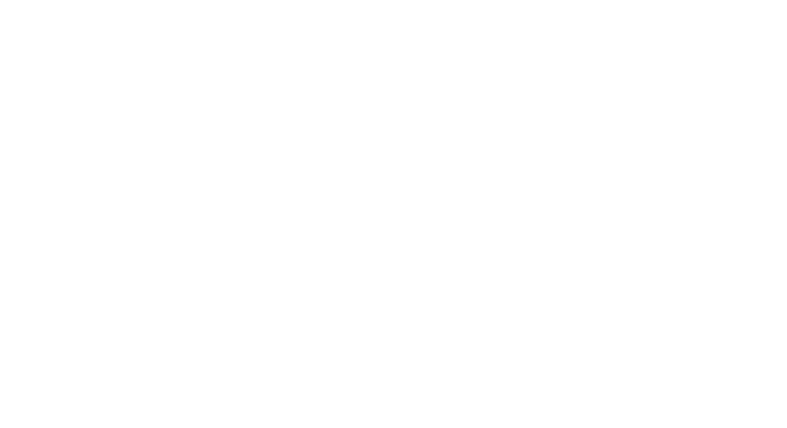

# DiPPER2
DiPPER2:  Diagnostic Primer Picking and Evaluation pipeline for Reliability and Reproducibility

>__+++++++++++++++++++++++++++++NOTE - IMPORTANT:+++++++++++++++++++++++++++++++__
>
>__This is a work in progress which has not been extensively unit tested and will likely undergo substantial refactoring in the near future.__
>
>__+++++++++++++++++++++++++++++++++++++++++++++++++++++++++++++++++++++++++++__

## Synopsis
__*This pipeline and modules are meant to facilitate reliable and reproducible finding of diagnostic targets and to make picking primers for those targets as user-friendly as possible. The approach taken is a phylogeny-driven and clade-specific approach.*__ 

The pipeline, once functional, automatically finds unique genomic regions for a target species, pathovar or race with moderate user intervention, automatically picks primers for these regions that are amenable to both conventional PCR and quantitative PCR, and finally tests them for specificity and sensitivity.

## Overview

## Requirements
The following programs need to be in path:

* BLAST+
* seqkit
* FUR
* primer3_core

It also requires python 3.

